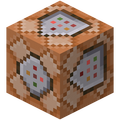
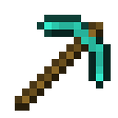
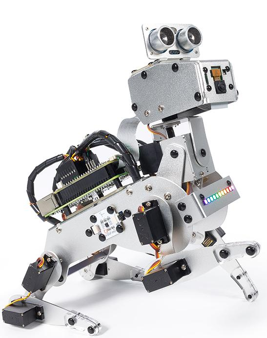
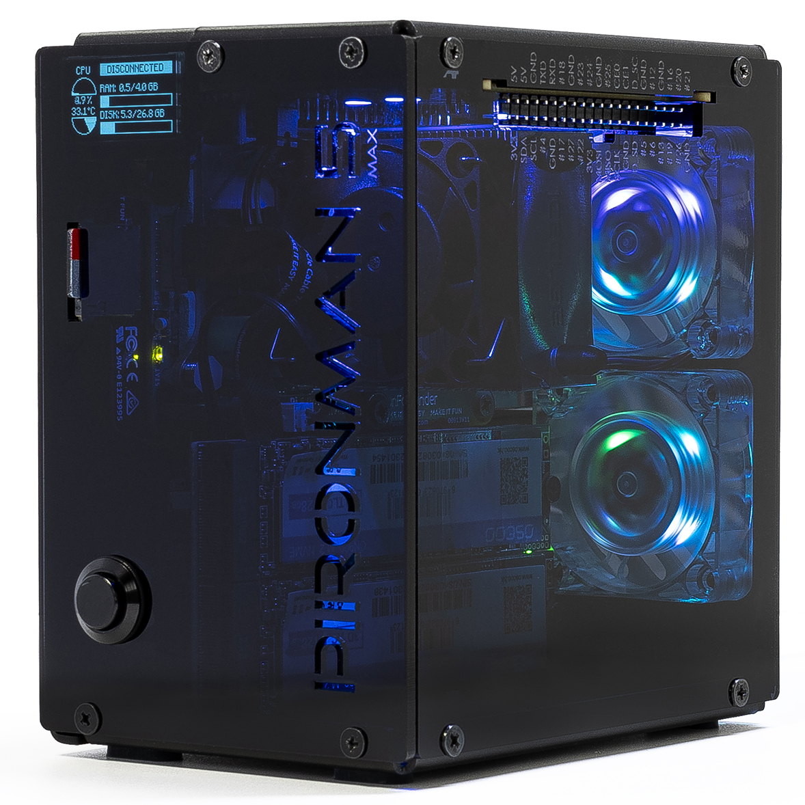
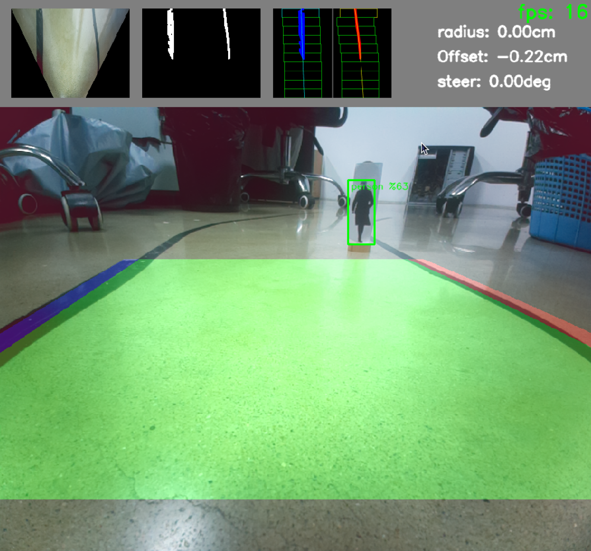

## Hi there 👋

<!--
**Lovmong/Lovmong** is a ✨ _special_ ✨ repository because its `README.md` (this file) appears on your GitHub profile.

Here are some ideas to get you started:

- 🔭 I’m currently working on ...
- 🌱 I’m currently learning ...
- 👯 I’m looking to collaborate on ...
- 🤔 I’m looking for help with ...
- 💬 Ask me about ...
- 📫 How to reach me: ...
- 😄 Pronouns: ...
- ⚡ Fun fact: ...
-->

  

<!-- https://shields.io/ -->
<!-- https://simpleicons.org/ -->
<!-- https://shields.io/docs/logos -->
###  Languages

###  Platform

###  Tools
 

---

<!--  -->

###  Some Projects

<table style="width:100%">
  <tr>
    <th>
      

           
             PiDog
            <a href="https://github.com/sunfounder/pidog" name="pidog_code">(pidog code)</a>
      

    </th>
        <th>

           
            Pironman5 Max
            <a href="https://github.com/sunfounder/pironman5" name="pironman5_code">(pironman5 code)</a>
        

    </th>
       <th>

           
            Neo
            <a href="https://github.com/sunfounder/Neo/tree/main/auto_driver_example" name="neo_code">(Neo code)</a>
        

    </th>
  </tr> 
</table>
